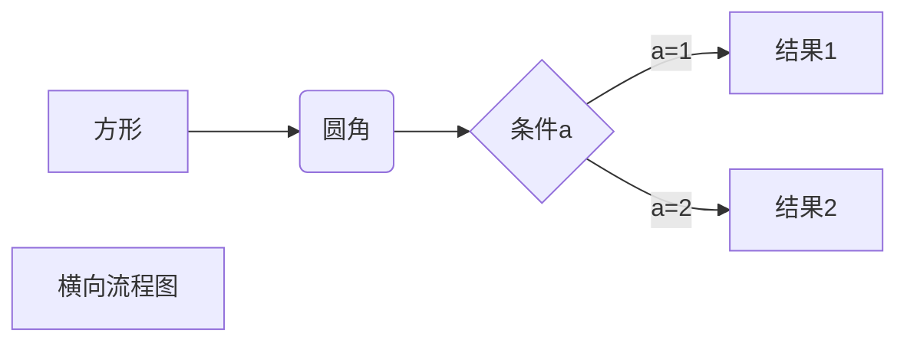
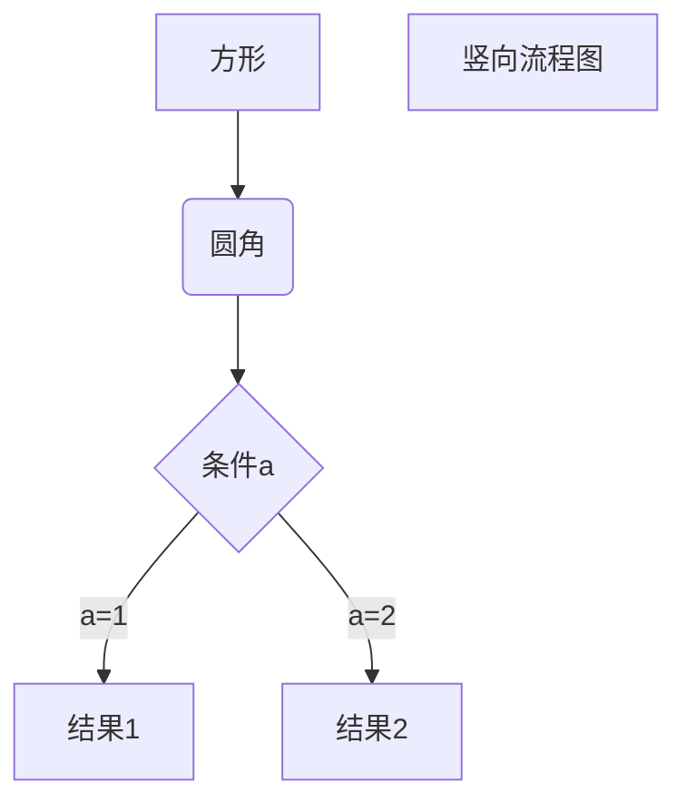
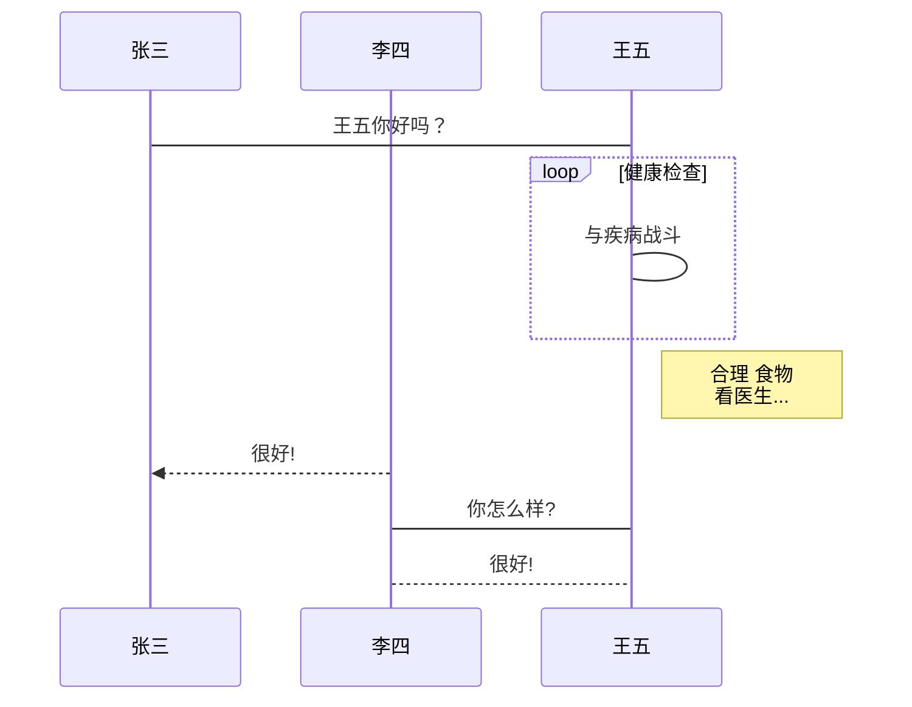
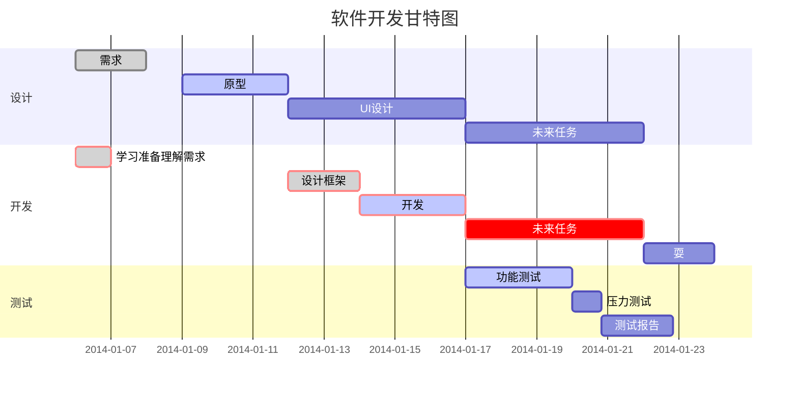

这位老哥写的已经挺全了，刚好有一些语法忘记了，留个档

## 一、概述

### 1.1 设计理念

- Markdown 易于阅读，方便创作 web 文档，利于各平台无缝分发。
- Markdown 语法灵感最大的来源还是纯文本 email 的格式，完全由标点符号标签组成的纯文本。
- Markdown 文件应该以纯文本形式原样发布，不应该包含标记标签和格式化指令。

### 1.2 内联 HTML 语法

- HTML 是一种发布格式，Markdown 是一种创作格式。
- Markdown 语法集合比较小，只是 HTML 标签的一小部分。
- 对于 Markdown 中未包含的标签, 可以直接使用 HTML 标签，例如用 HTML `<a>` 标签替代 Markdown 的链接语法。

### 1.3 特殊字符自动转义

在 HTML 中, 有两个字符需要特殊对待: `<` 和 `&`，左尖括号用于起始标签。果你想将它们用作字面量, 你必须将它们转义为字符实体, 例如 `&lt;` 和 `&amp;`。

## 二、行内语法讲解

### 2.1 注释的表述

- 代码法

```html
<div style='display: none'>
哈哈我是注释，不会在浏览器中显示。
</div>
```

- HTML 注释

既然支持 HTML 语法，那也支持 HTML 注释，快捷键 <kbd>command</kbd> + <kbd>/</kbd>。

```html
<!--哈哈我是注释，不会在浏览器中显示。-->
<!--
  哈哈我是多段注释，
  不会在浏览器中显示。
-->
```

- hack 方法

hack 方法就是利用 markdown 的解析原理来实现注释的。

一般有的 markdown 解析器不支持上面的注释方法，这个时候就可以用 hack 方法。

hack 方法比上面2种方法稳定得多，但是语义化太差。

```markdown
[//]: # (哈哈我是最强注释，不会在浏览器中显示。)
[^_^]: # (哈哈我是最萌注释，不会在浏览器中显示。)
[//]: <> (哈哈我是注释，不会在浏览器中显示。)
[comment]: <> (哈哈我是注释，不会在浏览器中显示。)
```

### 2.2 分级标题、任务列表

- 分级标题

```markdown
# 一级标题
## 二级标题
### 三级标题
#### 四级标题 <!-- 博客文章中最好只用 2~4 -->
##### 五级标题
###### 六级标题  <!--最多6级标题-->
```

由于用了标记编辑器会把所有标题写到目录大纲中，在这里写的演示标题也会列进去，所以就不演示了。同学们自己在编辑器中观察，很简单，一级标题字号最大，依级递减。

- 任务列表

Markdown 语法：

```markdown
- [ ] 任务一 未做任务 `- + 空格 + [ ]`
- [x] 任务二 已做任务 `- + 空格 + [x]`
```

效果如下（有些不支持）：

- [ ] 任务一 未做任务 - + 空格 + [ ]
- [x] 任务二 已做任务 - + 空格 + [x]

### 2.3 缩进、换行、空行、对齐方式

- 首行缩进

不同特殊占位符所占空白是不一样大的。

```markdown
【1】 &emsp;或&#8195; //全角
【2】 &ensp;或&#8194; //半角
【3】 &nbsp;或&#160;  //半角之半角
```

- 换行

由于 markdown 编辑器的不同，可能在一行字后面，直接换行回车，也能实现换行，但是在 Visual Studio Code 上，想要换行**必须得在一行字后面空两个格子才行**。

```md
这是一个段落。
现在没有分隔，和上面的这行仍是一个段落。

上面有一个空行，这是一个独立的段落。  
上一行后面有两个空格，这还是一个独立的段落。
```

在编辑的时候有多少个空行（只要这一行只有回车或者 space 没有其他的字符就算空行），**在渲染之后，只隔着一行**。

- 对齐方式

利用 HTML 代码：

```markdown
<center>行中心对齐</center>
<p align="left">行左对齐</p>
<p align="right">行右对齐</p>
```

显示效果：

<center>行中心对齐</center>

<p align="left">行左对齐</p>

<p align="right">行右对齐</p>

### 2.4 斜体、粗体、删除线、下划线、背景高亮

代码：

```markdown
*斜体*或_斜体_
**粗体**
***加粗斜体***
~~删除线~~
++下划线++
==背景高亮==     有一些不支持
```

显示效果：

*斜体*   **粗体**   ***加粗斜体***   ~~删除线~~   ++删除线++   ==背景高亮==

### 2.5 超链接、页内链接、自动链接、注脚

- 行内式

语法说明：

`[]` 里写链接文字，`()` 里写链接地址, `()` 中的 `""` 中可以为链接指定 `title` 属性，`title` 属性可加可不加。`title` 属性的效果是鼠标悬停在链接上会出现指定的 `title` 文字，链接地址与 `title` 前有一个空格。

代码：

```markdown
欢迎阅读 [择势勤](https://www.jianshu.com/u/16d77399d3a7 "择势勤")
```

显示效果：

欢迎阅读 [择势勤](https://www.jianshu.com/u/16d77399d3a7 "择势勤")

- 参考式

参考式超链接一般用在学术论文上面，或者另一种情况，如果某一个链接在文章中多处使用，那么使用引用 的方式创建链接将非常好，它可以让你对链接进行统一的管理。

语法说明：

参考式链接分为两部分，文中的写法 `[链接文字][链接标记]`，在文本的任意位置添加`[链接标记]:链接地址`。

如果链接文字本身可以做为链接标记，你也可以写成`[链接文字][]`
`[链接文字]：链接地址`的形式，见代码的最后一行。

代码：

```markdown
我经常去的几个网站[Google][1]、[Leanote][2]。

[1]:http://www.google.com 
[2]:http://www.leanote.com
```

显示效果：

我经常去的几个网站[Google][1]、[Leanote][2]。

[1]:http://www.google.com
[2]:http://www.leanote.com

- 注脚

语法说明：

在需要添加注脚的文字后加上`脚注名字[^注脚名字]`，称为脚注。 然后在文本的任意位置（一般在最后）添加脚注，脚注前必须有对应的脚注名字。

注意：经测试注脚与注脚之间必须空一行，不然会失效。成功后会发现，即使你没有把注脚写在文末，经 Markdown 转换后，也会自动归类到文章的最后。

代码：

```markdown
使用 Markdown[^1]可以效率的书写文档, 直接转换成 HTML[^2]。

[^1]:Markdown是一种纯文本标记语言

[^2]:HyperText Markup Language 超文本标记语言
```

显示效果：

使用 Markdown[^1] 可以效率的书写文档，直接转换成 HTML[^2]。

[^1]:Markdown是一种纯文本标记语言

[^2]:HyperText Markup Language 超文本标记语言

注：脚注自动被搬运到最后面，请到文章末尾查看，脚注后方的链接可以直接跳转回到加注的地方。

- 锚点（页内超链接）

网页中，锚点其实就是页内超链接，也就是链接本文档内部的某些元素，实现当前页面中的跳转。比如我这里写下一个锚点，点击回到目录，就能跳转到目录。 在目录中点击这一节，就能跳过来。还有下一节的注脚。这些根本上都是用锚点来实现的，只支持在标题后插入锚点，其它地方无效。

文章内链接的格式和链接基本相同：`[示例](#示例)`

仅仅将小括号中的 `http(s)` 链接更换为以 `#` 开头的文章内链接。本文介绍的就是这种链接的使用方法。

1. 英文标题

   - 大写全部变为小写，空格用 `-` 代替：

    ```Markdown
    ## Section Title

    [Section Title](#section-title)
    ```

2. 中文标题

   - 同理，而且因为没有空格和大小写的问题，更加简单：

    ```markdown
    ## 标题1

    [标题1](#标题1) 
    ```

3. 带有多级序号

   - 如果带有 `1.4.2` 这种多级带点序号，只需保留数字，例如：

    ```markdown
    ### 1.4.2 三级目录

    [1.4.2 三级目录](#142-三级目录)
    ```

4. 中文、英文、数字混排

    ```markdown
    ### 2.6.1 Markdown 三级目录 1

    [2.6.1 Markdown 三级目录 1](#261-Markdown-三级目录-1)
    ```

- 自动链接

语法说明：

Markdown 支持以比较简短的自动链接形式来处理网址和电子邮件信箱，只要是用 `<>` 包起来， Markdown 就会自动把它转成链接。一般网址的链接文字就和链接地址一样，例如：

代码：

```markdown
&lt;http://example.com/&gt; &emsp;&emsp; 
<address@example.com>
```

显示效果：

<http://example.com/>

<address@example.com>

### 2.6 无序列表、有序列表、定义型列表

**无序列表**

使用 `*`，`+`，`-` 表示无序列表。

代码：

```markdown
* 无序列表项 一
+ 无序列表项 二
- 无序列表项 三
```

显示效果：

* 无序列表项 一
+ 无序列表项 二
- 无序列表项 三

**有序列表**

有序列表则使用数字接着一个英文句点加空格

代码：

```markdown
1. 有序列表项 一
2. 有序列表项 二
3. 有序列表项 三
```

显示效果：

1. 有序列表项 一
2. 有序列表项 二
3. 有序列表项 三

**定义型列表**

语法说明：

定义型列表由名词和解释组成。一行写上定义，紧跟一行写上解释。解释的写法 `:` 紧跟一个缩进（Tab）

代码

```markdown
Markdown
:   轻量级文本标记语言（左侧有一个可见的冒号和四个不可见的空格）
```

显示效果：

Markdown
:   轻量级文本标记语言，可以转换成 html，pdf 等格式

### 2.7 插入图像

语法中图片 Alt 的意思是如果图片因为某些原因不能显示，就用定义的图片 Alt 文字来代替图片。 图片 Title 则和链接中的 Title 一样，表示鼠标悬停与图片上时出现的文字。 Alt 和 Title 都不是必须的，可以省略，但建议写上。

Markdown 语法：

```markdown
<center>  <!--开始居中对齐-->

格式: 
</center> <!--结束居中对齐-->
```

效果如下：

<center>

</center>

### 2.8 多级引用

语法说明：

引用需要在被引用的文本前加上>符号和空格，允许多层嵌套，也允许你偷懒只在整个段落的第一行最前面加上 ` > `。

代码：

```markdown
>>> 请问 Markdown 怎么用？ - 小白
>> 自己看教程！ - 愤青
> 教程在哪？ - 小白
```

显示效果：

>>> 请问 Markdown 怎么用？ - 小白
>> 自己看教程！ - 愤青
> 教程在哪？ - 小白

### 2.9 转义字符、字体、字号、颜色

- 转义字符

Markdown 中的转义字符为 `\`，转义的有：

```md
\\ 反斜杠
\` 反引号 
\* 星号 
\_ 下划线 
\{\} 大括号 
\[\] 中括号 
\(\) 小括号  
\# 井号 
\+ 加号 
\- 减号 
\. 英文句号 
\! 感叹号
```

- 字体、字号、颜色

代码：

```md
<font face="黑体">我是黑体字</font>
<font face="微软雅黑">我是微软雅黑</font>
<font face="STCAIYUN">我是华文彩云</font>
<font color=#0099ff size=12 face="黑体">黑体</font>
<font color=gray size=5>gray</font>
<font color=#00ffff size=3>null</font>
```

显示效果：

<font face="黑体">我是黑体字</font>
<font face="微软雅黑">我是微软雅黑</font>
<font face="STCAIYUN">我是华文彩云</font>
<font color=#0099ff size=12 face="黑体">黑体</font>
<font color=gray size=5>gray</font>
<font color=#00ffff size=3>null</font>

## 三、块语法讲解

### 3.1 内容目录

在段落中填写 `[TOC]` 以显示全文内容的目录结构。

```md
[TOC]
```

### 3.2 代码块

对于程序员来说这个功能是必不可少的，插入程序代码的方式有两种，一种是利用缩进(Tab), 另一种是利用 ”`” 符号（一般在ESC键下方）包裹代码。

- 行内式

代码：

```markdown
C语言里的函数 `scanf()` 怎么使用？
```

显示效果：

C语言里的函数 `scanf()` 怎么使用？

- 缩进式多行代码

缩进 4 个空格或是 1 个制表符

一个代码区块会一直持续到没有缩进的那一行（或是文件结尾）。

代码：

```markdown
#include &lt;stdio.h&gt;
int main(void)
{
    printf(&#34;Hello world\n&#34;);
}
```

- 用六个 “`” 包裹多行代码

代码：

````md
```c
include <stdio.h>
int main(void)
{
printf("Hello world\n");
}
```
````

显示效果：

```c
include <stdio.h>
int main(void)
{
printf("Hello world\n");
}
```

### 3.3 流程图

编辑自有道云笔记，代码：

````md
```
graph LR
A-->B
```

```
sequenceDiagram
A->>B: How are you?
B->>A: Great!
```
````

显示效果：

```
graph LR
A-->B
```

```
sequenceDiagram
A->>B: How are you?
B->>A: Great!
```

### 3.4 表格

语法说明：

不管是哪种方式，第一行为表头，第二行分隔表头和主体部分，第三行开始每一行为一个表格行。

列于列之间用管道符 `|` 隔开。原生方式的表格每一行的两边也要有管道符。

第二行还可以为不同的列指定对齐方向。默认为左对齐，在 `-` 右边加上 `:` 就右对齐。

- `-` 左对齐
- ` :-: `中心对齐
- `-: `右对齐

表格代码：

```markdown
|学号|姓名|序号|
|-|-|-|
|小明明|男|5|
|小红|女|79|
|小陆|男|192|
```

原生方式写表格：

<center>
|学号|姓名|序号|
|-|-|-|
|小明明|男|5|
|小红|女|79|
|小陆|男|192|
</center>

### 3.5 LaTeX 公式

- 表示行内公式

代码：

```markdown
质能守恒方程可以用一个很简洁的方程式 `$E = m c^2 $` 来表达。
```

显示效果：

质能守恒方程可以用一个很简洁的方程式 `$E = m c^2 $` 来表达。

- 表示整行公式

大部分的浏览器支持的

```markdown
$$ 公式 $$
```

有道云笔记使用格式

````markdown
```math
E = mc^2
```
````

块级公式：

````markdown
```math
x = \dfrac{-b \pm \sqrt{b^2 - 4ac}}{2a} 
```
```math
[\frac{1}{\Bigl(\sqrt{\phi \sqrt{5}}-\phi\Bigr) e^{\frac25 \pi}} =
1+\frac{e^{-2\pi}} {1+\frac{e^{-4\pi}} {1+\frac{e^{-6\pi}}
{1+\frac{e^{-8\pi}} {1+\ldots} } } }]
```
````

显示效果：

```math
x = \dfrac{-b \pm \sqrt{b^2 - 4ac}}{2a} 
```

```math
[\frac{1}{\Bigl(\sqrt{\phi \sqrt{5}}-\phi\Bigr) e^{\frac25 \pi}} =
1+\frac{e^{-2\pi}} {1+\frac{e^{-4\pi}} {1+\frac{e^{-6\pi}}
{1+\frac{e^{-8\pi}} {1+\ldots} } } }]
```

访问 [MathJax](https://links.jianshu.com/go?to=https%3A%2F%2Fmath.meta.stackexchange.com%2Fquestions%2F5020%2Fmathjax-basic-tutorial-and-quick-reference) 参考更多使用方法。

### 3.6 分隔线

你可以在一行中用三个以上的星号、减号、底线来建立一个分隔线，行内不能有其他东西。你也可以在星号或是减号中间插入空格。下面每种写法都可以建立分隔线：

代码：

```markdown
* * *
***
*****
- - -
-----------
```

显示效果都一样：

---

### 3.7 HTML 原始码

在代码区块里面， `&`、 `<` 和 `>` 会自动转成 HTML 实体，这样的方式让你非常容易使用 Markdown 插入范例用的 HTML 原始码，只需要复制贴上，剩下的 Markdown 都会帮你处理，例如：

代码：

```markdown
第一个例子：
<div class="footer">
© 2004 Foo Corporation
</div>
第二个例子：
<center>
<table>
<tr>
<th rowspan="2">值班人员</th>
<th>星期一</th>
<th>星期二</th>
<th>星期三</th>
</tr>
<tr>
<td>李强</td>
<td>张明</td>
<td>王平</td>
</tr>
</table>
</center>
```

显示效果：

第一个例子：

<div class="footer">
© 2004 Foo Corporation
</div>

第二个例子：

<center>
<table>
<tr>
<th rowspan="2">值班人员</th>
<th>星期一</th>
<th>星期二</th>
<th>星期三</th>
</tr>
<tr>
<td>李强</td>
<td>张明</td>
<td>王平</td>
</tr>
</table>

</center>

### 3.8 特殊字

```markdown
特殊字符	描述	字符的代码
空格符	&nbsp;
<	小于号	&lt;
>	大于号	&gt;
&	和号	&amp;
￥	人民币	&yen;
©	版权	&copy;
®	注册商标	&reg;
°C	摄氏度	&deg;C
±	正负号	&plusmn;
×	乘号	&times;
÷	除号	&divide;
²	平方（上标²）	&sup2;
³	立方（上标³）	&sup3;
```

> 文章转载自简书
> 版权归属 ©2019 择势勤
> 作者：择势勤
> 链接：<https://www.jianshu.com/p/ebe52d2d468f#fnref1>

还有其他的，顺便也记一下

其他支持的 HTML 元素有：

```md
<kbd>按键</kbd>
<b>加粗</b>
<i>倾斜</i> 
<em>强调</em> 
<sup>上标</sup>  
<sub>下标</sub>
换行 <br />
etc.
```

可折叠片段

```markdown
<details>
  <summary>展开查看</summary>
啊啦~被你发现啦！
</details>
```

<details>
  <summary>展开查看</summary>
啊啦~被你发现啦！
</details>

横向流程图源码格式：



竖向流程图源码格式：



标准流程图源码格式：

```flow
st=>start: 开始框
op=>operation: 处理框
cond=>condition: 判断框(是或否?)
sub1=>subroutine: 子流程
io=>inputoutput: 输入输出框
e=>end: 结束框
st->op->cond
cond(yes)->io->e
cond(no)->sub1(right)->op
```

标准流程图源码格式（横向）：

```flow
st=>start: 开始框
op=>operation: 处理框
cond=>condition: 判断框(是或否?)
sub1=>subroutine: 子流程
io=>inputoutput: 输入输出框
e=>end: 结束框
st(right)->op(right)->cond
cond(yes)->io(bottom)->e
cond(no)->sub1(right)->op
```

UML 时序图源码样例：

```sequence
对象A->对象B: 对象B你好吗?（请求）
Note right of 对象B: 对象B的描述
Note left of 对象A: 对象A的描述(提示)
对象B-->对象A: 我很好(响应)
对象A->对象B: 你真的好吗？
```

UML 时序图源码复杂样例：

```sequence
Title: 标题：复杂使用
对象A->对象B: 对象B你好吗?（请求）
Note right of 对象B: 对象B的描述
Note left of 对象A: 对象A的描述(提示)
对象B-->对象A: 我很好(响应)
对象B->小三: 你好吗
小三-->>对象A: 对象B找我了
对象A->对象B: 你真的好吗？
Note over 小三,对象B: 我们是朋友
participant C
Note right of C: 没人陪我玩
```

UML 标准时序图样例：



甘特图样例：



[小书匠](http://markdown.xiaoshujiang.com/)中支持的语法非常多，可以去试用下哈
